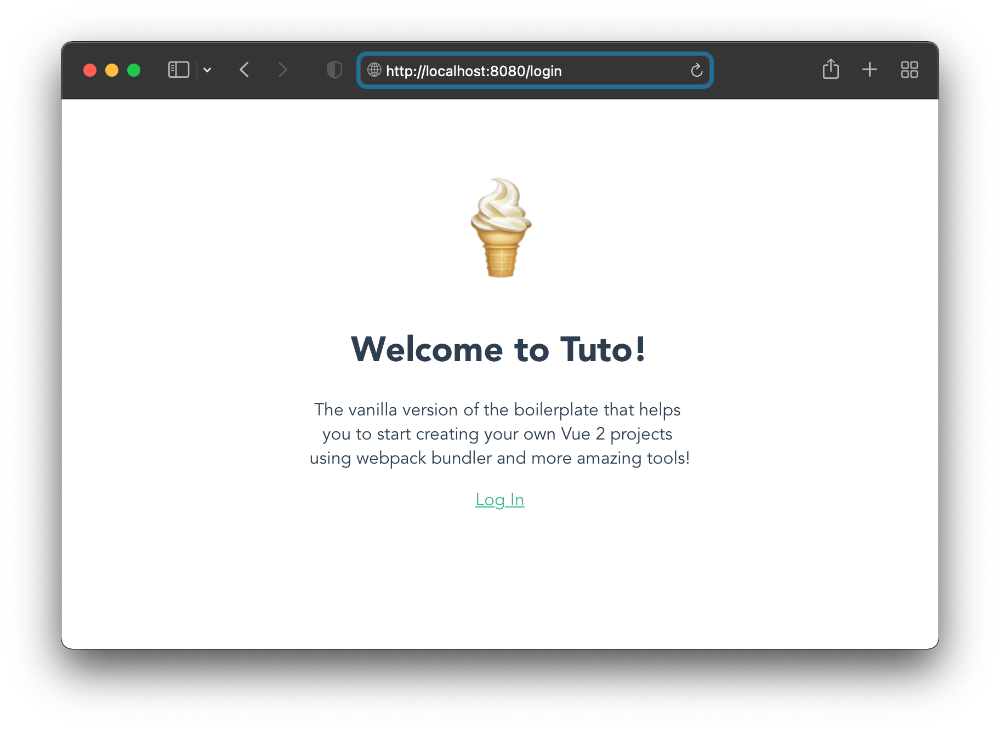

<div align="center">
  <h1>
    <br/>
    🍦
    <br />
    <br />
    Vanilla Tuto
    <br />
    <br />
  </h1>
  <sup>
    <br />
   A Vue 2 Starter Boilerplate with Vue Router 3, Vuex 3, Webpack 5, Axios, Jest and More.</em>
    <br />
    <br /

[](https://github.com/morellexf26/tuto/releases)
[](https://github.com/morellexf26/tuto/blob/main/LICENSE)
[](https://www.npmjs.com/package/vanilla-tuto)
[](https://v2.vuejs.org)

  </sup>
</div>



Tuto is the short of Tutorial and the best/easier way to start creating a SPA using the best frameworks out there!

<br>

## 👨🏻‍🏫 Basic topics

- [What is Vue?](https://v2.vuejs.org/v2/guide/#What-is-Vue-js)
- [Single-File Components](https://v2.vuejs.org/v2/guide/single-file-components.html)
- [Reactivity in Depth](https://v2.vuejs.org/v2/guide/reactivity.html)
- [Computed Properties and Watchers](https://v2.vuejs.org/v2/guide/computed.html)
- [Props](https://v2.vuejs.org/v2/guide/components-props.html)
- [Slots](https://v2.vuejs.org/v2/guide/components-slots.html)
- [Vuex Store v3 - Getting Started](https://v3.vuex.vuejs.org/)
- [Vue Router v3 - Getting Started](https://v3.router.vuejs.org/)
- [Jest Unit Tests (🇪🇸)](https://medium.com/@agustinmorelle01/las-7-claves-del-%C3%A9xito-tests-unitarios-de-frontend-vue-js-y-jest-28988ae561ac)

<br>

## 💎 Features

- Basic login/logout state definition using Vuex Store v3.x.
- Basic Store configured using Vuex and Persist Plugin (stores/index.js).
- Basic "Home" and "Login" pages defined (src/pages/).
- Basic router configuration defined (/router.js).
- Basic GET request using Axios (Spotify Tracker API). This request needs an [Authorization Bearer Token ](https://developer.spotify.com/console/get-users-currently-playing-track/). For security purposes you can just set this token on environment files.
- Environment file example.
- Jest configuration defined.
- API Unit test included.
- Path alias defined (webpack.config.js).
- GitHub actions workflow example defined.

<br>

## 🏛 Project Structure

```json
tuto
├─ .babelrc
├─ LICENSE
├─ README.md
├─ babel.config.json
├─ jest.config.js // 🃏 Unit tests configuration
├─ jsconfig.json
├─ package-lock.json
├─ package.json
├─ router.js // 🧭 Handle page routes
├─ src
│  ├─ App.vue
│  ├─ assets
│  │  ├─ css
│  │  │  └─ index.css // 🎨 Main stylesheet file
│  │  ├─ favicon.ico
│  │  ├─ logo.png
│  │  ├─ screenshots
│  │  │  └─ login.png
│  │  └─ scripts
│  │     └─ api.js // 📡 Handle api calls
│  ├─ components
│  │  ├─ MainSection.vue
│  │  └─ UserSessionLink.vue
│  ├─ index.html
│  ├─ main.js // 🪴 Application's entry point
│  └─ pages
│     ├─ Home.vue
│     ├─ Login.vue
│     └─ SpotifyTracker.vue
├─ stores
│  └─ index.js // 💾 Save general state of the app
├─ tests // 🃏 Unit tests
│  └─ unit
│     └─ spotify.spec.js
├─ vue.config.js // 🍦 Vue framework setup
└─ webpack.config.js // 📦 Bundler setup, alias and more

```


<br>

## 🚀 Install

Install it locally in your project

```bash
npm install

npm run dev
```

<br>


## 🧪 Unit tests

```
npm run test
```

